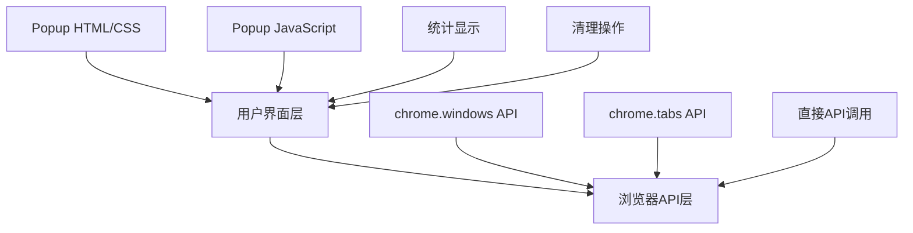
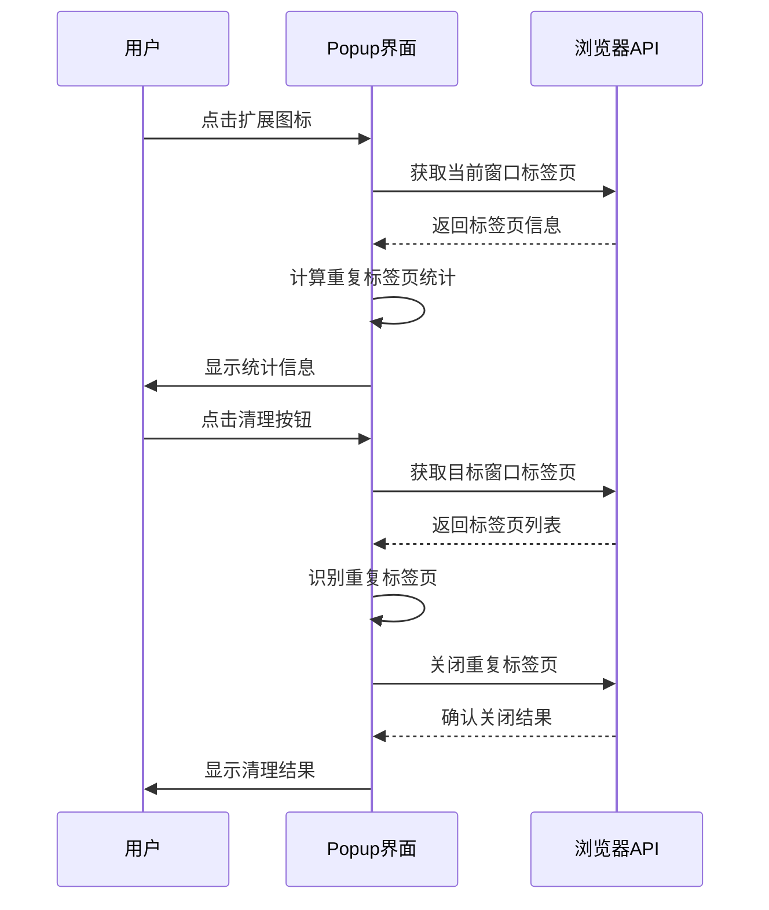

# 设计文档

## 概述

重复标签页清理器是一个基于Chrome Manifest V3的浏览器扩展，采用简化的直接API调用架构设计。系统通过比较标签页URL来识别重复标签页，并提供安全的清理机制。设计遵循Chrome扩展最佳实践，优先考虑简洁性、可靠性和用户体验。

## 架构

### 整体架构

系统采用简化的两层架构，避免复杂的消息传递机制：



### 组件交互流程



## 组件和接口

### 1. 弹出界面组件 (Popup Interface)

**职责**: 用户交互、标签页统计、重复检测、直接API调用

**接口**:
```javascript
// 清理结果接口
interface CleanupResult {
  success: boolean;
  duplicatesFound: number;
  tabsClosed: number;
  message: string;
  error?: string;
}

// 窗口统计信息
interface WindowStats {
  totalTabs: number;
  duplicateTabs: number;
}
```

**关键方法**:
- `cleanTabs(cleanAllWindows)`: 主清理逻辑
- `cleanWindowTabs(windowId)`: 清理指定窗口的重复标签页
- `updateTabStats()`: 更新标签页统计
- `showResult(message, type)`: 显示操作结果

### 2. 重复检测逻辑 (Duplicate Detection Logic)

**职责**: 标签页重复性分析、URL标准化

**算法设计**:
```javascript
// 重复标签页识别算法
function identifyDuplicateTabs(tabs) {
  const seenUrls = new Map();
  const tabsToClose = [];
  
  for (const tab of tabs) {
    // 跳过正在播放音频的标签页
    if (tab.audible) continue;
    
    // 跳过Chrome内部页面
    if (tab.url.startsWith('chrome://') || tab.url.startsWith('edge://')) continue;
    
    try {
      const url = new URL(tab.url);
      const cleanUrl = url.origin + url.pathname + url.search;
      
      if (seenUrls.has(cleanUrl)) {
        tabsToClose.push(tab.id);
      } else {
        seenUrls.set(cleanUrl, tab.id);
      }
    } catch (error) {
      console.warn('跳过无效URL:', tab.url);
    }
  }
  
  return tabsToClose;
}
```

### 3. 后台脚本组件 (Background Script)

**职责**: 最小化的后台服务，仅处理扩展安装事件

**接口**:
```javascript
// 简化的后台脚本
chrome.runtime.onInstalled.addListener(() => {
  console.log('扩展已安装');
});
```

## 数据模型

### 标签页数据模型

```javascript
// Chrome Tab 模型（使用原生API）
interface Tab {
  id: number;
  url: string;
  title: string;
  active: boolean;
  windowId: number;
  audible: boolean; // 是否正在播放音频
}

// 清理会话模型
interface CleanupSession {
  windowId: number;
  tabsAnalyzed: number;
  duplicatesFound: number;
  tabsClosed: number;
  errors: string[];
}
```

## 正确性属性

*属性是一个特征或行为，应该在系统的所有有效执行中保持为真——本质上是关于系统应该做什么的正式声明。*

基于实际实现，以下是系统必须满足的正确性属性：

**属性 1: URL标准化一致性**
*对于任何* 标签页URL，标准化处理应该产生一致的结果，忽略查询参数和锚点的差异
**验证：需求 1.2**

**属性 2: 重复标签页识别准确性**
*对于任何* 标签页集合，当存在具有相同标准化URL的标签页时，系统应该正确识别所有重复标签页并保留第一个
**验证：需求 1.3**

**属性 3: 音频标签页保护**
*对于任何* 正在播放音频的标签页，系统应该跳过该标签页不进行清理
**验证：需求 1.4**

**属性 4: 系统页面过滤**
*对于任何* Chrome内部页面（chrome://或edge://），系统应该跳过这些页面不进行处理
**验证：需求 1.5**

**属性 5: 统计信息准确性**
*对于任何* 窗口的标签页集合，系统报告的统计信息应该与实际的标签页数量和重复数量完全匹配
**验证：需求 2.2**

**属性 6: 清理操作完整性**
*对于任何* 重复标签页清理操作，系统应该安全关闭所有标记的重复标签页，并返回包含准确统计信息的详细结果
**验证：需求 3.1, 5.1, 5.2**

## 错误处理

### 简化的错误处理策略

由于采用直接API调用架构，错误处理变得更加简单和直接：

```javascript
// 统一错误处理
async function safeApiCall(apiCall, errorMessage) {
  try {
    return await apiCall();
  } catch (error) {
    console.warn(errorMessage, error);
    return null;
  }
}

// 清理操作错误处理
async function cleanWindowTabs(windowId) {
  try {
    const tabs = await chrome.tabs.query({ windowId: windowId });
    // ... 清理逻辑
    return { success: true, /* ... */ };
  } catch (error) {
    return {
      success: false,
      error: error.message,
      message: '清理过程中出现错误'
    };
  }
}
```

## 测试策略

### 简化的测试方法

基于实际的简化架构，测试策略也相应简化：

**单元测试重点**：
1. **URL标准化测试**
   - 测试查询参数和锚点的处理
   - 测试特殊字符和编码
   - 测试无效URL的处理

2. **重复检测算法测试**
   - 测试无重复标签页的情况
   - 测试完全重复的标签页
   - 测试音频标签页的跳过逻辑

3. **用户界面测试**
   - 测试统计信息显示
   - 测试清理结果反馈
   - 测试错误状态处理

**集成测试**：
- 端到端清理流程测试
- Chrome API调用测试
- 用户交互流程测试

由于架构简化，不再需要复杂的消息传递测试和Service Worker测试。