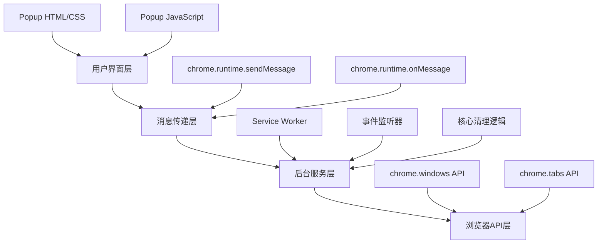
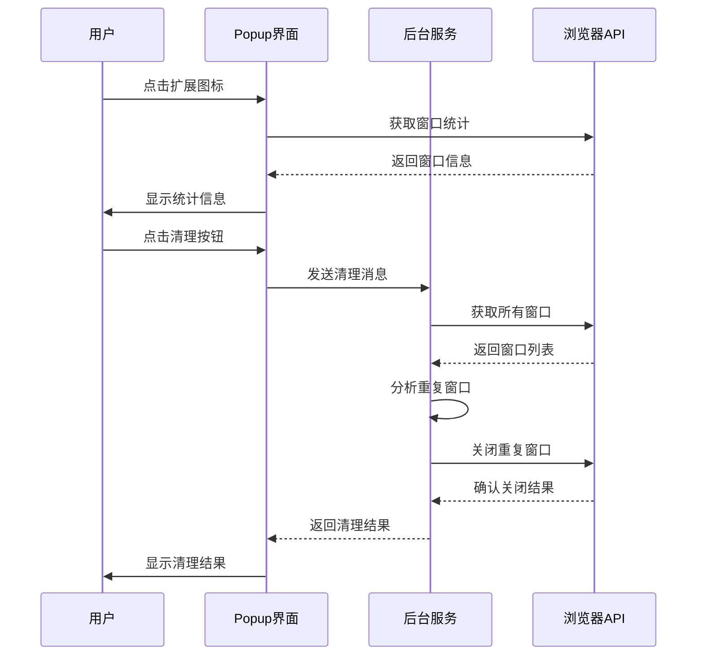

# 设计文档

## 概述

重复窗口清理器是一个基于Chrome Manifest V3的浏览器扩展，采用事件驱动架构设计。系统通过分析窗口中标签页的URL组合来识别重复窗口，并提供安全的清理机制。设计遵循Chrome扩展最佳实践，确保性能、安全性和用户体验的平衡。

## 架构

### 整体架构

系统采用典型的Chrome扩展三层架构：



### 组件交互流程



## 组件和接口

### 1. 后台服务组件 (Background Service)

**职责**: 核心业务逻辑处理、事件监听、API调用管理

**接口**:
```javascript
// 消息处理接口
interface MessageHandler {
  action: 'cleanDuplicates';
  response: CleanupResult;
}

// 清理结果接口
interface CleanupResult {
  success: boolean;
  duplicatesFound: number;
  windowsClosed: number;
  message: string;
  error?: string;
}

// 核心清理函数
async function cleanDuplicateWindows(): Promise<CleanupResult>
```

**关键方法**:
- `cleanDuplicateWindows()`: 主清理逻辑
- `generateWindowSignature()`: 生成窗口URL签名
- `identifyDuplicateWindows()`: 识别重复窗口
- `safeCloseWindows()`: 安全关闭窗口

### 2. 弹出界面组件 (Popup Interface)

**职责**: 用户交互、状态显示、消息传递

**接口**:
```javascript
// UI状态管理
interface UIState {
  isLoading: boolean;
  windowStats: WindowStats;
  lastResult: CleanupResult | null;
}

// 窗口统计信息
interface WindowStats {
  totalWindows: number;
  totalTabs: number;
}
```

**关键方法**:
- `updateWindowStats()`: 更新窗口统计
- `handleCleanupClick()`: 处理清理按钮点击
- `showResult()`: 显示操作结果
- `toggleLoadingState()`: 切换加载状态

### 3. 重复检测引擎 (Duplicate Detection Engine)

**职责**: 窗口重复性分析、URL签名生成

**算法设计**:
```javascript
// URL签名生成算法
function generateURLSignature(tabs) {
  return tabs
    .map(tab => tab.url)
    .filter(url => url && !url.startsWith('chrome://'))
    .sort()
    .join('|');
}

// 重复窗口识别算法
function identifyDuplicates(windows) {
  const signatureMap = new Map();
  const duplicates = [];
  
  for (const window of windows) {
    if (window.state === 'minimized') continue;
    
    const signature = generateURLSignature(window.tabs);
    if (signatureMap.has(signature)) {
      duplicates.push(window.id);
    } else {
      signatureMap.set(signature, window.id);
    }
  }
  
  return duplicates;
}
```

## 数据模型

### 窗口数据模型

```javascript
// Chrome Window 扩展模型
interface ExtendedWindow {
  id: number;
  tabs: Tab[];
  state: 'normal' | 'minimized' | 'maximized' | 'fullscreen';
  urlSignature: string;
  isDuplicate: boolean;
  createdTime?: number;
}

// 标签页数据模型
interface Tab {
  id: number;
  url: string;
  title: string;
  active: boolean;
  windowId: number;
}

// 清理会话模型
interface CleanupSession {
  sessionId: string;
  startTime: number;
  endTime?: number;
  windowsAnalyzed: number;
  duplicatesFound: number;
  windowsClosed: number;
  errors: string[];
}
```

### 配置数据模型

```javascript
// 扩展配置模型
interface ExtensionConfig {
  autoCleanEnabled: boolean;
  autoCleanInterval: number; // 分钟
  excludeMinimizedWindows: boolean;
  confirmBeforeClosing: boolean;
  logLevel: 'error' | 'warn' | 'info' | 'debug';
}
```

## 正确性属性

*属性是一个特征或行为，应该在系统的所有有效执行中保持为真——本质上是关于系统应该做什么的正式声明。属性作为人类可读规范和机器可验证正确性保证之间的桥梁。*

基于需求分析，以下是系统必须满足的正确性属性：

### 将EARS转换为属性

基于预工作分析，以下是从验收标准转换而来的可测试属性：

**属性 1: URL签名确定性**
*对于任何* 标签页URL集合，无论输入顺序如何，生成的URL签名都应该相同
**验证：需求 1.3**

**属性 2: 重复窗口识别准确性**
*对于任何* 窗口集合，当存在具有相同URL组合的窗口时，系统应该正确识别所有重复窗口并保留最早创建的窗口
**验证：需求 1.2, 1.5**

**属性 3: 最小化窗口过滤**
*对于任何* 包含最小化和正常状态窗口的集合，重复检测应该只处理非最小化状态的窗口
**验证：需求 1.4**

**属性 4: 统计信息准确性**
*对于任何* 窗口和标签页集合，系统报告的统计信息应该与实际的窗口数量和标签页数量完全匹配
**验证：需求 2.2, 7.3**

**属性 5: 清理操作完整性**
*对于任何* 重复窗口清理操作，系统应该安全关闭所有标记的重复窗口，并返回包含准确统计信息的详细结果
**验证：需求 2.3, 3.1, 3.3, 4.1, 4.2**

**属性 6: 错误恢复能力**
*对于任何* 窗口关闭操作失败的情况，系统应该记录错误、继续处理其他窗口，并在最终结果中包含错误信息
**验证：需求 3.2, 5.2, 5.3**

## 错误处理

### 错误分类和处理策略

1. **API调用错误**
   - Chrome API权限不足
   - 窗口或标签页不存在
   - 网络连接问题

2. **业务逻辑错误**
   - 无效的窗口状态
   - URL解析失败
   - 重复检测算法异常

3. **用户界面错误**
   - 弹出窗口加载失败
   - 消息传递中断
   - 界面状态不一致

### 错误处理机制

```javascript
// 统一错误处理器
class ErrorHandler {
  static async handleAPIError(error, context) {
    const errorInfo = {
      type: 'API_ERROR',
      message: error.message,
      context: context,
      timestamp: Date.now()
    };
    
    console.error('API错误:', errorInfo);
    return this.createUserFriendlyMessage(errorInfo);
  }
  
  static createUserFriendlyMessage(errorInfo) {
    const messages = {
      'API_ERROR': '浏览器API调用失败，请重试',
      'PERMISSION_ERROR': '权限不足，请检查扩展权限设置',
      'WINDOW_NOT_FOUND': '窗口已关闭或不存在',
      'UNKNOWN_ERROR': '发生未知错误，请重启浏览器后重试'
    };
    
    return messages[errorInfo.type] || messages['UNKNOWN_ERROR'];
  }
}

// 重试机制
class RetryHandler {
  static async withRetry(operation, maxRetries = 3, delay = 1000) {
    for (let attempt = 1; attempt <= maxRetries; attempt++) {
      try {
        return await operation();
      } catch (error) {
        if (attempt === maxRetries) {
          throw error;
        }
        await this.delay(delay * attempt);
      }
    }
  }
  
  static delay(ms) {
    return new Promise(resolve => setTimeout(resolve, ms));
  }
}
```

## 测试策略

### 双重测试方法

系统将采用单元测试和基于属性的测试相结合的方法：

**单元测试**：
- 验证特定示例和边缘情况
- 测试错误条件和异常处理
- 验证UI组件的特定行为
- 测试API集成点

**基于属性的测试**：
- 验证跨所有输入的通用属性
- 通过随机化提供全面的输入覆盖
- 测试系统在各种条件下的正确性保证

### 基于属性的测试配置

**测试库选择**: 使用 `fast-check` JavaScript属性测试库

**测试配置**:
- 每个属性测试最少运行100次迭代
- 每个测试必须引用其设计文档属性
- 标签格式: **Feature: duplicate-window-cleaner, Property {number}: {property_text}**

**测试数据生成器**:
```javascript
// 窗口数据生成器
const windowGenerator = fc.record({
  id: fc.integer(1, 1000),
  state: fc.constantFrom('normal', 'minimized', 'maximized'),
  tabs: fc.array(tabGenerator, 1, 10)
});

// 标签页数据生成器
const tabGenerator = fc.record({
  id: fc.integer(1, 10000),
  url: fc.webUrl(),
  title: fc.string(1, 100),
  active: fc.boolean()
});

// URL集合生成器
const urlSetGenerator = fc.array(fc.webUrl(), 1, 20);
```

### 单元测试重点

1. **URL签名生成测试**
   - 测试空URL列表
   - 测试包含chrome://协议的URL
   - 测试特殊字符和编码

2. **重复检测算法测试**
   - 测试无重复窗口的情况
   - 测试完全重复的窗口
   - 测试部分重复的窗口

3. **错误处理测试**
   - 模拟API调用失败
   - 测试权限不足的情况
   - 测试网络连接问题

4. **用户界面测试**
   - 测试弹出窗口加载
   - 测试按钮状态切换
   - 测试结果显示格式

### 集成测试

1. **端到端清理流程测试**
   - 创建测试窗口环境
   - 执行完整清理流程
   - 验证最终状态

2. **消息传递测试**
   - 测试弹出窗口与后台服务通信
   - 测试快捷键事件处理
   - 测试异步操作协调

3. **权限和API测试**
   - 验证所需权限声明
   - 测试Chrome API调用
   - 验证错误处理机制

每个正确性属性必须通过单独的基于属性的测试实现，每个测试运行最少100次迭代以确保通过随机化获得全面覆盖。