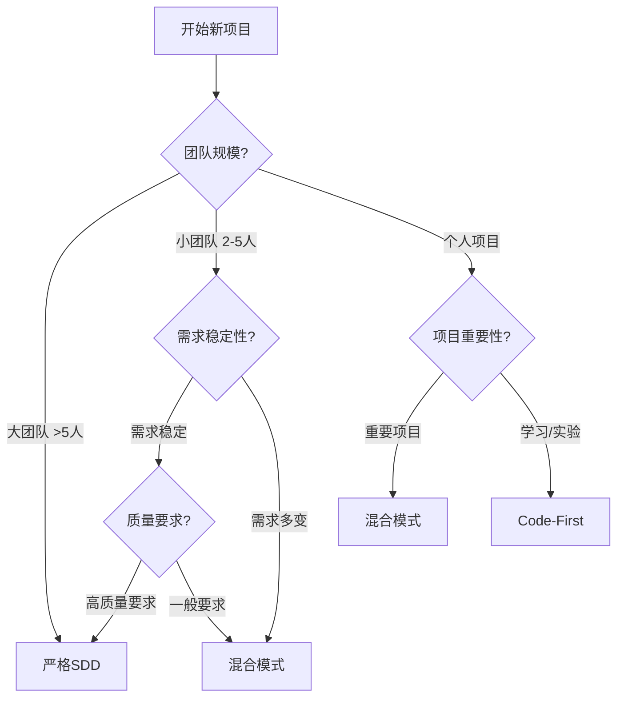

# 软件开发模式对比分析

## 概述

在软件开发过程中，选择合适的开发模式对项目成功至关重要。本文档基于实际项目经验，对比分析三种主要的开发模式，帮助开发者根据项目特点选择最适合的方法。

## 三种开发模式

### 1. 严格规格驱动开发 (Strict Specification-Driven Development)

#### 流程图
```
需求变更 → 更新规格文档 → 设计评审 → 实现代码 → 验证符合规格
    ↑                                                    ↓
    ←←←←←←←←←←← 发现问题时返回 ←←←←←←←←←←←←←←←←←←←←←←←
```

#### 特点
- **文档优先**: 所有变更必须先更新规格文档
- **严格流程**: 每个阶段都有明确的交付物和评审
- **高度规范**: 遵循标准的文档格式和流程

#### 优势
- ✅ **文档与代码始终同步** - 避免文档过时问题
- ✅ **决策过程透明** - 所有变更都有完整记录
- ✅ **团队协作友好** - 规格文档是沟通的共同语言
- ✅ **质量保证强** - 强制的思考和评审环节
- ✅ **可维护性高** - 未来修改有清晰的指导文档
- ✅ **知识传承好** - 新成员容易理解项目

#### 劣势
- ❌ **响应速度慢** - 每次变更都需要更新多个文档
- ❌ **文档维护成本高** - 需要额外的时间和精力投入
- ❌ **可能过度设计** - 为了文档完整性而增加不必要的复杂度
- ❌ **灵活性差** - 难以快速适应意外发现和需求变化
- ❌ **学习成本高** - 需要掌握规格文档的编写规范

#### 适用场景
- 🏢 **大型团队项目** - 需要多人协作，沟通成本高
- 📋 **需求相对稳定** - 变更频率不高的项目
- 🔒 **高质量要求** - 如金融、医疗、航空等关键系统
- 📚 **长期维护项目** - 需要详细文档支持的系统
- 👥 **团队成员流动性大** - 文档是知识传承的重要载体
- 🏛️ **合规要求严格** - 需要完整文档记录的项目

---

### 2. 实用主义混合模式 (Pragmatic Hybrid Development)

#### 流程图
```
初始规格 → 实现中快速调整 → 事后文档化 → 定期同步
    ↑           ↓                    ↑           ↓
    ←←← 重大变更时更新规格 ←←←←←←←←←←←←←←←←←←←
```

#### 特点
- **灵活平衡**: 在规范性和灵活性之间找平衡
- **关键节点文档化**: 重要变更及时更新文档
- **实用导向**: 优先解决实际问题

#### 优势
- ✅ **响应速度快** - 能快速解决用户问题和技术难题
- ✅ **适应性强** - 容易处理意外情况和技术限制
- ✅ **实用性高** - 优先解决实际问题，避免过度设计
- ✅ **学习效率高** - 通过实践快速发现和解决问题
- ✅ **用户满意度高** - 快速响应用户反馈
- ✅ **成本可控** - 文档工作量适中，不会成为负担

#### 劣势
- ❌ **文档可能滞后** - 容易出现文档与代码不一致
- ❌ **决策记录不完整** - 可能丢失重要的设计思路
- ❌ **需要自律** - 依赖开发者主动维护文档同步
- ❌ **质量风险** - 缺少严格的评审环节
- ❌ **团队协作挑战** - 需要团队有良好的沟通习惯

#### 适用场景
- 🚀 **快速原型开发** - 需要快速验证想法的项目
- 🔄 **需求变化频繁** - 用户反馈驱动的敏捷项目
- 👤 **小团队项目** - 沟通成本相对较低
- 🧪 **探索性技术项目** - 技术方案不确定的项目
- ⏰ **时间压力适中** - 既要快速交付又要保证质量
- 🎯 **功能导向项目** - 重点关注功能实现的项目

---

### 3. 纯代码优先开发 (Pure Code-First Development)

#### 流程图
```
直接编码 → 测试验证 → 快速迭代 → (可选)事后文档
    ↑         ↓          ↑              ↓
    ←←←←← 发现问题立即修改 ←←←←←←←←←←←←←←←
```

#### 特点
- **代码即文档**: 以代码作为主要的沟通和记录方式
- **快速迭代**: 最短的反馈循环
- **极简流程**: 最少的流程开销

#### 优势
- ✅ **开发速度最快** - 没有文档编写的时间开销
- ✅ **灵活性最高** - 可以随时调整方向和实现方式
- ✅ **学习成本最低** - 不需要掌握规格文档编写规范
- ✅ **适合探索** - 需求不明确时可以快速试错
- ✅ **反馈最直接** - 代码运行结果就是最直接的反馈
- ✅ **创新友好** - 不受文档约束，容易产生创新方案

#### 劣势
- ❌ **可维护性差** - 缺乏设计文档指导，难以理解设计意图
- ❌ **团队协作困难** - 只有代码作为沟通媒介，理解成本高
- ❌ **质量风险高** - 缺乏设计评审和规范约束
- ❌ **重构成本高** - 架构问题往往发现较晚
- ❌ **知识传承困难** - 新成员难以快速理解项目
- ❌ **技术债务积累** - 容易产生不规范的代码

#### 适用场景
- 🔬 **技术验证项目** - 主要目的是验证技术可行性
- 🎯 **一次性脚本** - 不需要长期维护的工具
- 📖 **个人学习项目** - 个人技能提升和实验
- 🏃 **紧急修复** - 生产环境问题的紧急处理
- 💡 **创意原型** - 快速验证创意想法
- 🧪 **技术探索** - 研究新技术和框架

## 模式选择决策树



## 实际案例分析

### 案例：Chrome扩展项目

**项目特点**：
- 👤 个人项目，沟通成本低
- 🔄 需求在开发过程中发生重大变化
- ⚡ 用户反馈需要快速响应
- 🧪 Chrome扩展技术方案需要探索

**选择的模式**: 实用主义混合模式

**效果评估**：
- ✅ **成功响应需求变更** - 从"重复窗口清理"改为"重复标签页清理"
- ✅ **灵活处理技术限制** - Service Worker方案失败后快速切换到直接API调用
- ✅ **及时解决用户痛点** - 快速移除冲突的快捷键功能
- ✅ **最终交付可用产品** - 用户满意度高

**时间分配**：
- 10% 初始规格编写
- 70% 实现和迭代
- 20% 事后文档整理

**经验教训**：
- 混合模式在这个项目中是最优选择
- 关键是要在项目结束后及时更新文档
- 小功能增加时，先更新规格再实现是高效的

## 模式改进建议

### 严格SDD的改进
1. **引入敏捷元素** - 缩短文档评审周期
2. **工具化支持** - 使用工具自动化文档生成和同步
3. **分层文档** - 区分核心文档和详细文档，减少维护负担

### 混合模式的改进
1. **建立检查点** - 定期检查文档与代码的一致性
2. **关键决策记录** - 重大变更必须及时更新文档
3. **轻量级规格** - 保持文档简洁，避免过度设计

### Code-First的改进
1. **代码注释规范** - 用详细注释补充文档不足
2. **定期重构** - 及时清理技术债务
3. **关键设计记录** - 至少记录核心架构决策

## 效率对比分析

### 时间分配对比

| 开发阶段 | 严格SDD | 混合模式 | Code-First |
|---------|---------|----------|------------|
| 需求分析 | 30% | 10% | 5% |
| 设计文档 | 40% | 5% | 0% |
| 编码实现 | 25% | 70% | 90% |
| 测试验证 | 15% | 10% | 5% |
| 文档整理 | 5% | 15% | 0% |

### 质量指标对比

| 质量指标 | 严格SDD | 混合模式 | Code-First |
|---------|---------|----------|------------|
| 代码质量 | ⭐⭐⭐⭐⭐ | ⭐⭐⭐⭐ | ⭐⭐⭐ |
| 可维护性 | ⭐⭐⭐⭐⭐ | ⭐⭐⭐⭐ | ⭐⭐ |
| 开发速度 | ⭐⭐ | ⭐⭐⭐⭐ | ⭐⭐⭐⭐⭐ |
| 团队协作 | ⭐⭐⭐⭐⭐ | ⭐⭐⭐ | ⭐⭐ |
| 适应变化 | ⭐⭐ | ⭐⭐⭐⭐⭐ | ⭐⭐⭐⭐⭐ |

## 最佳实践建议

### 通用原则
1. **根据项目特点选择** - 没有万能的开发模式
2. **保持适度文档化** - 即使是快速开发也要有基本记录
3. **建立反馈机制** - 根据项目进展调整开发模式
4. **团队共识** - 确保团队成员理解并认同选择的模式

### 具体建议

#### 对于大型项目
- 采用严格SDD，但引入敏捷实践缩短迭代周期
- 建立文档模板和工具，降低文档维护成本
- 设立专门的架构师角色，负责设计文档质量

#### 对于中小型项目
- 采用混合模式，在灵活性和规范性之间平衡
- 建立关键决策记录机制
- 定期进行文档同步检查

#### 对于个人项目
- 根据项目重要性选择混合模式或Code-First
- 重要项目至少要有基本的需求和设计记录
- 学习项目可以纯Code-First，但要注意总结经验

## 结论

选择合适的开发模式是项目成功的关键因素之一。通过分析项目特点、团队情况和质量要求，可以选择最适合的开发模式：

- **严格SDD** 适合大型、长期、高质量要求的项目
- **混合模式** 适合大多数中小型项目，平衡效率和质量
- **Code-First** 适合探索性、一次性或学习性项目

关键是要根据实际情况灵活选择，并在项目进行过程中根据反馈进行调整。没有完美的开发模式，只有最适合当前项目的模式。

---

*本文档基于实际项目经验总结，欢迎根据新的实践经验持续更新和完善。*